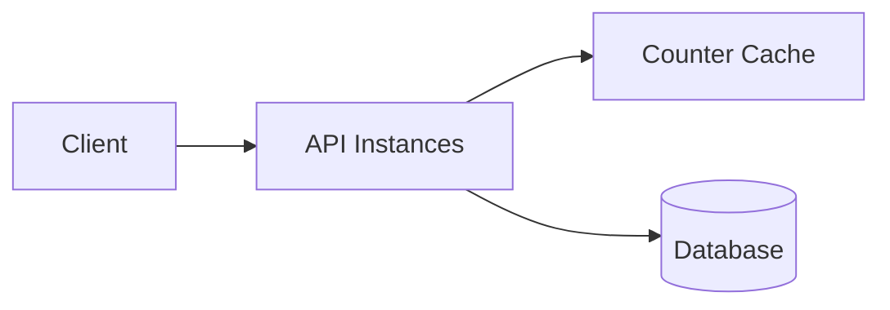
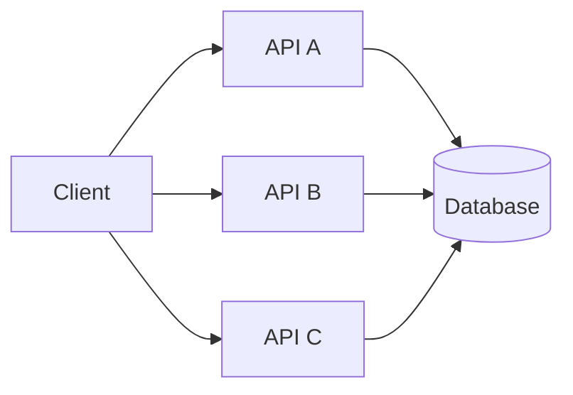
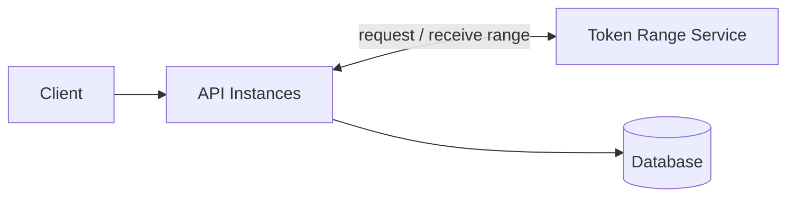
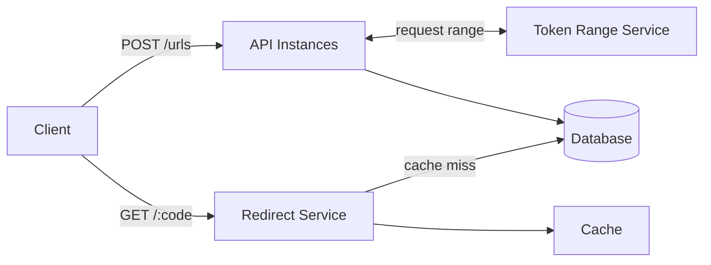

# URL Shortener

A URL shortener application built for educational purposes, deployed on Kubernetes.

> **Note:** This project is for learning and experimentation only — not intended for production use.

---

## Functional Requirements

- Authors can create short URLs by providing a full URL to be shortened
- Authors can view and manage their existing short URLs
- Each generated short URL is unique to prevent any conflicts
- Access is restricted to authorized team members only
- Users are automatically redirected from short URLs to their original long URLs

---

## Non-Functional Requirements

### Performance

| Metric | Value |
|--------|-------|
| Write throughput | 1,000 create operations/second |
| Read/write ratio | 1,000 : 1 |
| Read throughput | ~1,000,000 redirects/second |

### Short Code Length — Capacity Calculation

Short codes use a base-62 character set: digits `0-9`, lowercase `a-z`, uppercase `A-Z` — **62 possible characters per position**.

To pick a safe code length we calculate how many unique codes are needed to last without collision:

**Step 1 — codes consumed per year at target write load:**
```
1,000 creates/sec × 60 sec × 60 min × 24 hr × 365 days ≈ 31.5 billion/year
```

**Step 2 — compare code length options:**

| Length | Combinations | Years of capacity |
|--------|-------------|-------------------|
| 6 chars | 62⁶ ≈ 56 billion | ~1.5 years |
| 7 chars | 62⁷ ≈ 3.5 trillion | ~112 years |

**Decision: 7 characters.** Six characters would exhaust within two years at target load. Seven characters provides ~112 years of headroom — more than sufficient.

---

## Short Code Generation — Design Evolution

The write path that assigns unique short codes must work correctly across multiple API instances. Below is how the design evolves from a naive approach to a scalable one.

### Option 1: Centralized Cache Counter

A single shared cache holds a global counter. Each API instance atomically increments it to get the next ID.

**Problem:** The cache becomes a **single point of failure** and a write bottleneck — every create request must hit it.



### Option 2: Scaled API with No Coordination

The API layer is scaled horizontally. Without coordination, each instance generates IDs independently.

**Problem:** Instances will produce duplicate IDs (**collision risk**). Adding DB-level locking to prevent duplicates works but recreates the same bottleneck — every write still serializes through one resource.



### Option 3: Token Range Service

A dedicated service pre-allocates **ID ranges** to each API instance (e.g., API A → 1,000–1,999; API B → 2,000–2,999). Each instance increments its own in-memory counter — no network round-trip per create request.

When a range is exhausted, the instance requests the next one.

**Trade-off:** If an API instance crashes mid-range, the remaining IDs in that range are simply skipped — acceptable, since we only need uniqueness, not sequentiality. The real risk is the **Token Range Service** itself crashing and losing which ranges it already distributed. On restart, it could re-issue an already-assigned range and cause collisions. This is why the Token Range Service must persist its state durably — **Apache ZooKeeper** is one option for this kind of distributed coordination.



### Option 4: CQRS — Separate Read and Write Paths

At 1,000,000 redirects/second the read and write workloads scale very differently. The final design decouples them entirely:

- **Write path** (`POST /urls`) — API instances use Token Ranges for fast ID assignment, write to DB
- **Read path** (`GET /:code`) — a dedicated Redirect service, independently scaled, fronted by an aggressive cache to avoid a DB hit on every redirect


